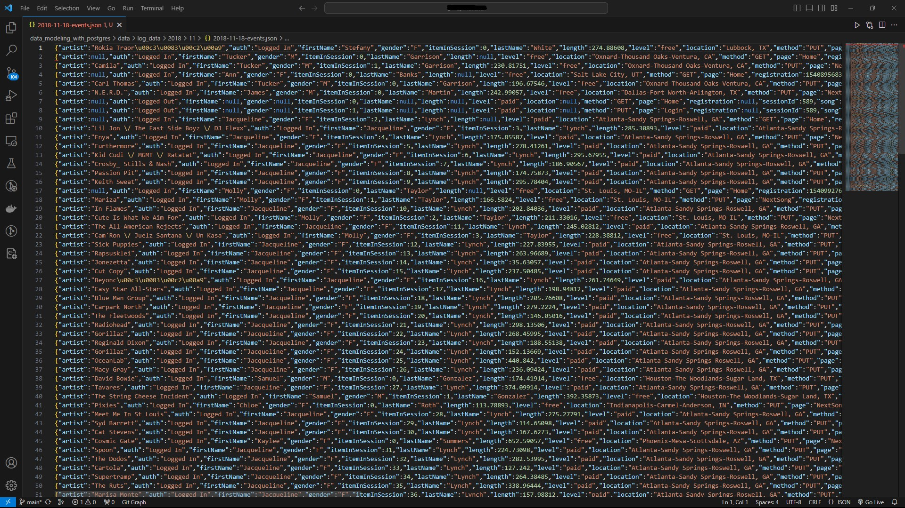
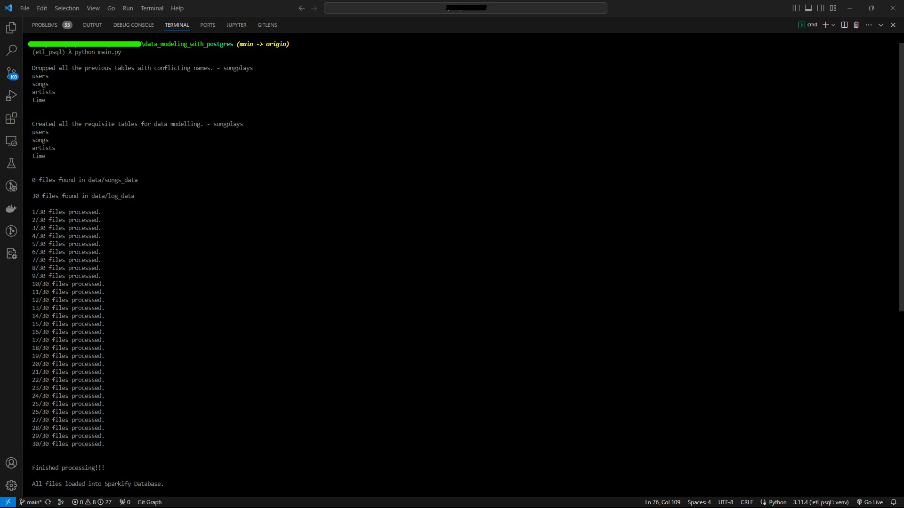
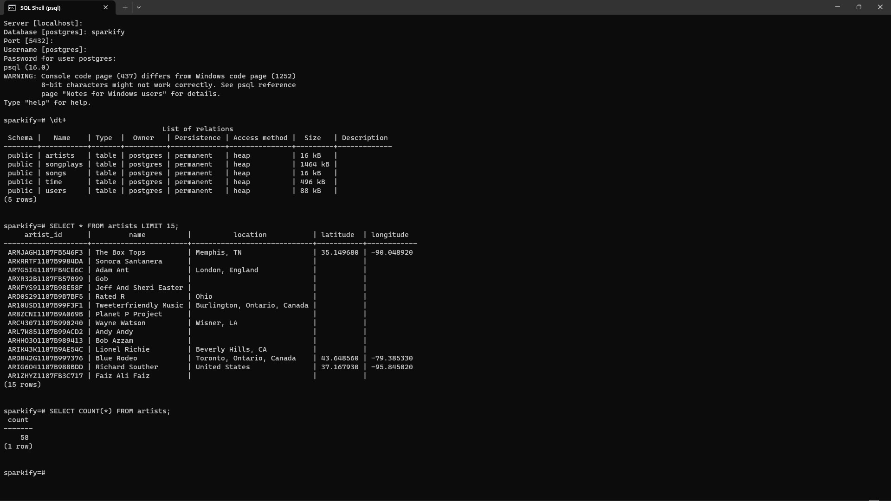
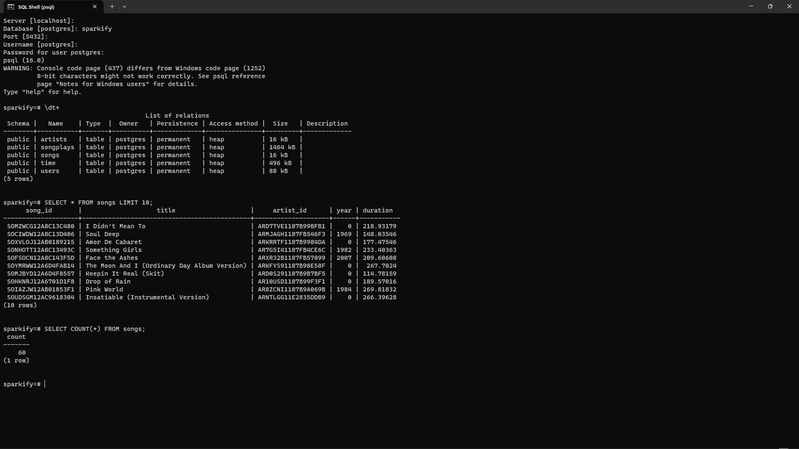

# __data_modeling_with_postgres__

## **Overview**

`For this endeavor, we utilize Data Modeling with Postgres and construct an ETL (Extract, Transform, Load) pipeline employing Python. A fledgling company aims to examine the information they have amassed pertaining to songs and user engagement on their recently launched music streaming application. Presently, they are gathering data in the json format, and the analytics team holds a specific focus on gaining insights into the songs that users are currently enjoying.`

## **Song Dataset**
The songs dataset is a subset of the [**Million Song Dataset**](http://millionsongdataset.com/).

Sample Record:
```
{
    "num_songs": 1,
    "artist_id": "ARJIE2Y1187B994AB7",
    "artist_latitude": null,
    "artist_longitude": null,
    "artist_location": "",
    "artist_name": "Line Renaud",
    "song_id": "SOUPIRU12A6D4FA1E1",
    "title": "Der Kleine Dompfaff",
    "duration": 152.92036,
    "year": 0
}
```

## **Log Dataset**
The logs dataset is generated by the [**Event Simulator**](https://github.com/Interana/eventsim).

Sample Record:
```
{
    "artist": null,
    "auth": "Logged In",
    "firstName": "Walter",
    "gender": "M",
    "itemInSession": 0,
    "lastName": "Frye",
    "length": null,
    "level": "free",
    "location": "San Francisco-Oakland-Hayward, CA",
    "method": "GET",
    "page": "Home",
    "registration": 1540919166796.0,
    "sessionId": 38,
    "song": null,
    "status": 200,
    "ts": 1541105830796,
    "userAgent": ""Mozilla/5.0 (Macintosh; Intel Mac OS X 10_9_4) AppleWebKit/537.36 (KHTML, like Gecko) Chrome/36.0.1985.143 Safari/537.36"",
    "userId": "39"
}
```

## **Sample Dataset Visual**



## **Database Schema**

### **Fact Table**
**`SongPlays`**: Records in log data associated with song plays, identified by the page `NextSong`.

```
songplay_id, start_time, user_id, level, song_id, artist_id, session_id, location, user_agent
```

### **Dimension Tables**
**`Users`** : users in the app
```
user_id, first_name, last_name, gender, level
```
**`Songs`** : songs in music database
```
song_id, title, artist_id, year, duration
```
**`Artists`** : artists in music database
```
artist_id, name, location, latitude, longitude
```
**`Time`** : timestamps of records in  **songplays**  broken down into specific units
```
start_time, hour, day, week, month, year, weekday
```

## **Project Files**

**`sql_queries.py`** -> contains sql queries for dropping and  creating fact and dimension tables. Also, contains insertion query template.

**`create_tables.py`** -> contains code for setting up database. Running this file creates **sparkifydb** and also creates the fact and dimension tables.

**`etl.ipynb`** -> a jupyter notebook to analyse dataset before loading. 

**`etl.py`** -> read and process **song_data** and **log_data**.

**`test.ipynb`** -> a notebook to connect to postgres db and validate the data loaded.

## **Environment** 
Python 3.6 or above

PostgresSQL 9.5 or above

psycopg2 - PostgreSQL database adapter for Python


## **How to run**

Run the drive program **`main.py`** as below.
```
python main.py
```



#### Visual of the deployed tables. Example:

##### Artist Table



##### Songs Table



The **`create_tables.py`** and **`etl.py`** file can also be run independently as below:
```
python create_tables.py 
python etl.py 
```

 ### **Reference:**
[**Psycopg**](http://initd.org/psycopg/docs/)

[**PostgreSQL Documentation**](https://www.postgresql.org/docs/)

[**Pandas Documentation**](https://pandas.pydata.org/pandas-docs/stable/)
